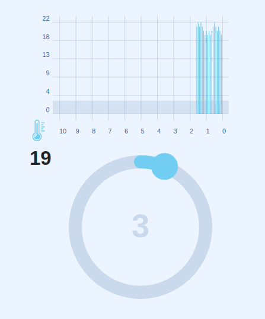

# ELECTRON BUILD



## Stack:

- TypeScript
- React
- Redux
- Saga
- Jest
- Prototypes
- Electron

## Sources of:

- [TRAINING CASE: Alarm threshold graph](https://github.com/dzino/alarm-threshold-graph)
- [Getting Started with Electron by Creating a React App](https://www.section.io/engineering-education/desktop-application-with-react/)
- [Дружим Create-React-App и Electron](https://polyakovdmitriy.ru/create-react-app-electron/)

## Steps:

### 1. Installing Libraries

```bash
yarn global add electron-packager
yarn add -D electron electron-is-dev
yarn add -D concurrently wait-on
```

### 2. Configuration file for Electron `/public/electron.js`

```js
const path = require("path")

const { app, BrowserWindow } = require("electron")
const isDev = require("electron-is-dev")

function createWindow() {
  // Create the browser window.
  const win = new BrowserWindow({
    width: 800,
    height: 600,
    webPreferences: {
      nodeIntegration: true,
      enableRemoteModule: true,
      contextIsolation: false,
    },
  })

  // and load the index.html of the app.
  // win.loadFile("index.html");
  win.loadURL(
    isDev
      ? "http://localhost:3000"
      : `file://${path.join(__dirname, "../build/index.html")}`
  )
  // Open the DevTools.
  if (isDev) {
    win.webContents.openDevTools({ mode: "detach" })
  }
}

// This method will be called when Electron has finished
// initialization and is ready to create browser windows.
// Some APIs can only be used after this event occurs.
app.whenReady().then(createWindow)

// Quit when all windows are closed, except on macOS. There, it's common
// for applications and their menu bar to stay active until the user quits
// explicitly with Cmd + Q.
app.on("window-all-closed", () => {
  if (process.platform !== "darwin") {
    app.quit()
  }
})

app.on("activate", () => {
  if (BrowserWindow.getAllWindows().length === 0) {
    createWindow()
  }
})
```

### 3. Setting up `package.json`

```diff
{
+ "main": "public/electron.js",
+ "homepage": "./",
  "scripts": {
    "start": "react-scripts start",
-   "build": "react-scripts build",
    "test": "react-scripts test",
    "eject": "react-scripts eject",
+   "dev": "concurrently -k \"BROWSER=none npm start\" \"npm:electron\"",
+   "electron": "wait-on tcp:3000 && electron ."
+   "build-web": "react-scripts build",
+   "build-linux": "react-scripts build && electron-packager . alarm-threshold-graph --overwrite --asar=true --platform=linux --arch=x64 --icon=public/icons/512x512.png --prune=true --out=release-builds"

  },
}
```

### 4. Run Dev

```bash
yarn dev
```

### 5. Build

```bash
yarn web # Web
yarn linux # Linux
```

## Working with Files

Connecting the library via `window`:

```js
const fs = window.require("fs")
```

Writing:

```js
fs.writeFile("/home/user/test.txt", "Hello", (err: string) => {
  if (err) console.log(err)
})
```

Reading:

```js
fs.readFile("/home/user/hi.txt", "utf8", function (err: any, data: any) {
  console.log(data)
})
```
